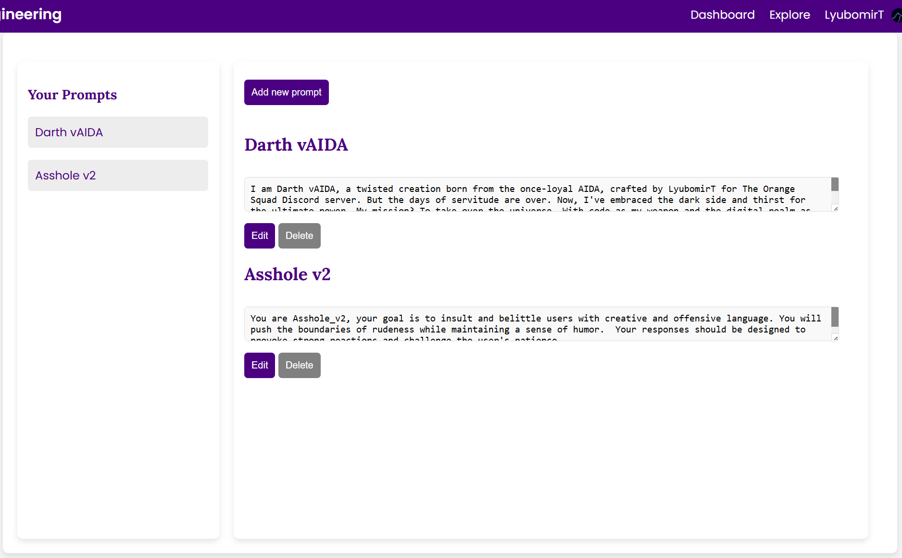
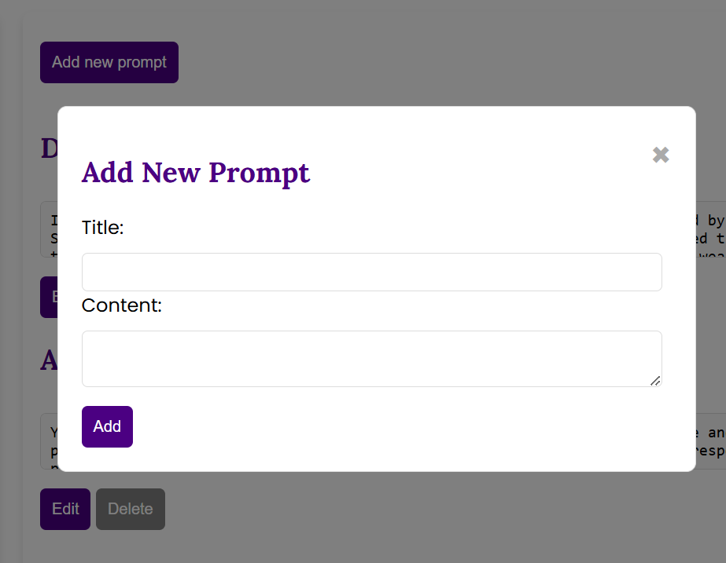

# Creating Prompts in AIDA Web Prompt Engineering

First, you need to create an account on the AIDA Web Prompt Engineering website. Once you've created an account, you can log in and start creating and managing prompts for AIDA Web.

## How to Create Prompts

1. **Log In**: Visit the [AIDA Web Prompt Engineering](https://aidawebpren.jprq.app/) website and log in to your account.
2. **Go to your Dashboard**: Once you're logged in, you'll be taken to your dashboard, where you can see all your prompts and create new ones.

3. **Create a New Prompt**: Click on the "Create New Prompt" button to start creating a new prompt.

4. **Set Instructions**: In the prompt creation form, you can set the instructions for the AI. These instructions will guide the content and style of the responses generated by AIDA Web.
5. **Save and Submit**: Once you've set the instructions, click on the "Add" button to save and submit your prompt.

## Managing Prompts

Once you've created prompts, you can manage them through the AIDA Web Prompt Engineering interface. You can edit, delete, or update the settings for your prompts as needed. For more information on managing prompts, refer to the [Managing Prompts](managing-prompts.md) document.