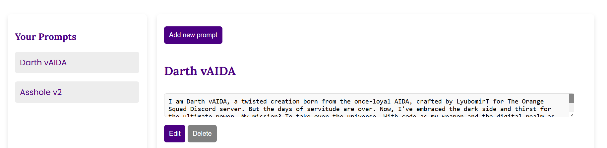

# Managing Prompts in AIDA Web Prompt Engineering

It's quite easy, actually. Once you've created prompts, you can manage them through the AIDA Web Prompt Engineering interface. You can edit, delete, or update the settings for your prompts as needed. All management actions are done through the dashboard, which you can access after logging in to your account.

## Deleting Prompts

Let's say you don't like a prompt anymore or you've created too many and want to clean up. You can delete prompts by clicking on the "Delete" button next to the prompt you want to remove.

## Editing Prompts

If you want to make changes to a prompt, you can edit it by clicking on the "Edit" button next to the prompt. This will open the prompt editor, where you can modify the instructions or settings for the prompt.

## Updating Prompt Settings

Coming soon!