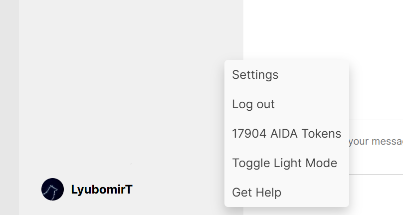
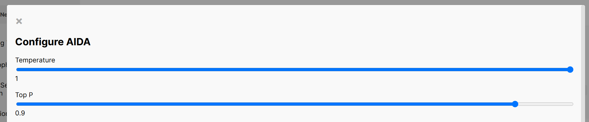
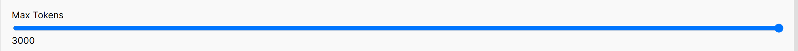
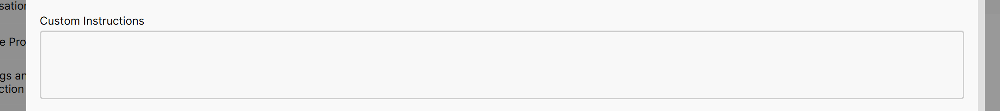

# Customizing Responses

AIDA Web lets you instruct the AI to generate text based on how you want the responses to be. This customization feature allows you to control the tone, style, and content of the generated text. 

## How to Instructions

First, visit the [AIDA Web](https://aidaweb.jprq.app/) website, then open the settings by clicking on your account button and selecting "Settings." In the settings, you can customize how the AI behaves.

In the settings, you can tinker around with all sorts of options, but since we're focusing on customizing responses, let's look at these:

1. **Randomness**: There are two sliders that set how random the AI's responses are. The first slider controls the "Temperature" of the AI, which determines how creative or random the responses are. The second slider controls the "Top P" value, which sets the probability of the AI choosing from the most likely tokens. Adjust these sliders to control the randomness of the responses.

Simply drag the sliders to adjust the values according to your preference.

2. **Response Length**: You can set the minimum and maximum length of the responses generated by the AI. This allows you to control how long or short the responses should be.

You can drag the sliders to set the minimum and maximum response length, but note that this also affects the cost of generating responses. (AIDA Tokens are used to interact with AIDA Web, and the cost of generating responses is based on the length of the response.)

3. **Custom Instructions**: You can provide custom instructions to the AI to guide the content and style of the responses. These instructions can be general guidelines or specific details on how you want the text to be generated.

Basically, you need to type in the instructions you want the AI to follow. For example, you can ask the AI to generate a response in a formal tone, or you can ask it to include specific keywords in the response.

---

And that's it! Feel free to experiment, just note that the more specific or longer the instructions, the more it might cost you in terms of AIDA Tokens. But hey, it's all about getting the responses you want, right? So, go ahead and customize away!

