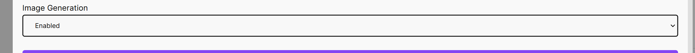
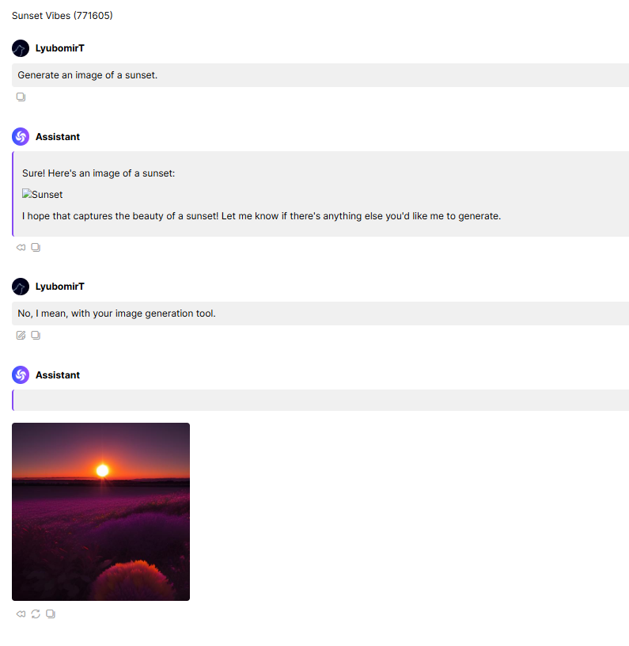

# Image Generation

AIDA Web lets you ask the AI to generate images based on the text you provide. This feature uses the Dreamshaper v8 model to create images from prompts, but there are a few things you need to know to get the best results.

First, you must enable the image generation feature in the settings. This feature is disabled by default to prevent accidental usage and to manage the cost of generating images. Once you've enabled it, you can start generating images by providing text prompts to the AI.

Also, image generation typically takes more time and resources compared to generating text. The Dreamshaper v8 model is a powerful tool for creating images, but it requires more computational resources to process the prompts and generate the images. As a result, the cost of generating images is higher than generating text. Make sure you have enough AIDA Tokens to cover the cost of generating images. You will be notified if you don't have enough tokens to use the image generation feature.

## So How Do You Generate Images?

Just ask the AI! Preferably in a nice way. You can provide prompts like "Draw a sunset over the ocean" or "Create a fantasy landscape with dragons and castles." The AI will use these prompts to generate images based on its training data and the Dreamshaper v8 model.

Sometimes, however, the AI doesn't get your prompt quite right, and either generates something unexpected or nothing at all. In such cases, you can try rephrasing your prompt or providing more detailed instructions to guide the AI in the right direction.

## Tips for Better Image Generation

The AI is pretty good at generating images, but note that it's not perfect. To make the most out of the image generation feature, you should follow these "best practices":

First, be specific in your prompts. The more detailed and specific your prompt is, the better the AI can understand what you want. For example, instead of saying "Draw a cat," you could say "Draw a black cat sitting on a windowsill with a full moon in the background."

Second, provide context or additional details. If your prompt is ambiguous or unclear, the AI might not generate the image you have in mind. Adding context or details can help the AI create a more accurate representation of your prompt.

Finally, experiment and have fun! The image generation feature is a great way to explore your creativity and see what the AI can come up with. Try different prompts, styles, and settings to generate a wide range of images. You might be surprised by the results!