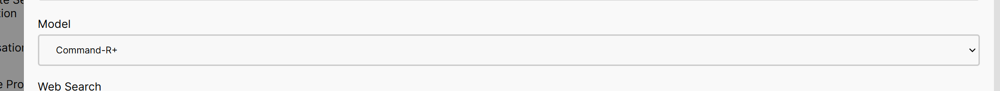

# Switching Models

AIDA Web has three built-in models you can chat with: Command, Command-R, and Command-R+. Each model has its own unique characteristics and strengths, and you can switch between them based on your preferences and the type of responses you want to generate.

## Models Overview

| Model       | Description                                                                                   |
|-------------|-----------------------------------------------------------------------------------------------|
| Command     | The Command model is optimized for generating short, concise responses to specific queries. It's also the oldest model released by Cohere, but is still pretty much powerful. It's supposedly 27B parameters. |
| Command-R   | The Command-R model is an improved version of the Command model, designed to generate more detailed and context-aware responses. It's a bit larger than the Command model, with 106B parameters. Best at changing tone and style using response customization. |
| Command-R+  | The Command-R+ model is the latest and most powerful model in the lineup. It's designed to generate longer, more detailed, and contextually rich responses. It's the largest model with 175B parameters. |

## How to Switch Models

To switch between models in AIDA Web, you can go to the settings and select the model you want to use. Just click on your account button and choose "Settings." In the settings, you'll find an option to switch models, then save your changes.

Once you've selected a new model, the AI will start using that model to generate responses based on your input. Each model has its own strengths and characteristics, so feel free to experiment with them to see which one works best for your needs.

## Can I Switch Models Mid-Conversation?

Yes, you can switch models mid-conversation in AIDA Web. If you feel that a different model might provide better responses to your queries, you can switch models at any time during the conversation. The AI will adapt to the new model and generate responses accordingly.

It's best to experiment with different models to see which one aligns with your preferences and generates the type of responses you're looking for. Remember, each model has its own unique strengths and capabilities, so don't hesitate to switch between them to get the best results.