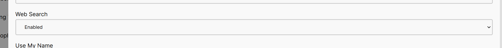

# Web Search

AIDA Web has a built-in RAG-based web search feature that allows you to search the web and retrieve relevant information. This feature is particularly useful when you need quick answers or want to explore a topic further.

## Prerequisites

Before you can use the web search feature, make sure you have activated your AIDA Tokens. You can earn AIDA Tokens by participating in events, challenges, and other activities in The Orange Squad. If you haven't activated your AIDA Tokens yet, refer to the [AIDA Tokens](../orange-bank/aidaweb.md) document for more information.

Also, ensure that you have Web Search enabled in the settings. You can access the settings by clicking on your account button and selecting "Settings." In the settings, you can enable the Web Search feature.

## How to Search the Web

Just like you would ask a question to a search engine, you can ask AIDA Web to search the web for you. Simply provide a query or question, and the AI will use the RAG-based web search feature to find relevant information.

For example, you can ask questions like:

- "What is the capital of France?"
- "How does the COVID-19 vaccine work?"
- "Who is the author of 'To Kill a Mockingbird'?"

The AI will process your query and provide you with a response based on the information it finds on the web. Do note that the responses are generated based on the search results and may not always be 100% accurate, also the AI may not be able to access certain websites or databases.

And lastly, it takes a few moments for the AI to search the web and generate a response, so please be patient while waiting for the results.