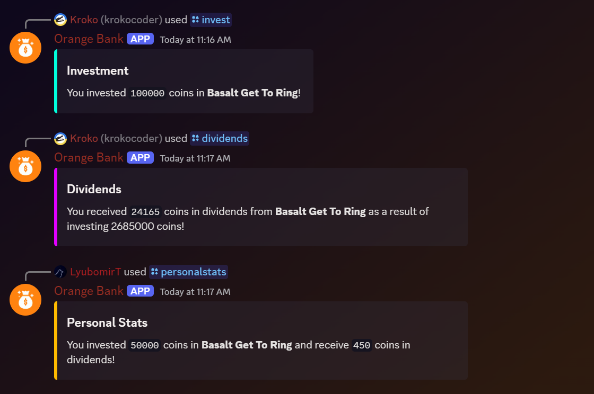

# Investment Guide of Orange Bank

This is a guide on how to invest your coins in the stock market of Orange Bank. Investing is a great way to earn money, but it can also be risky since companies can go bankrupt or lose value. This guide will help you understand the basics of investing and give you some tips on how to make smart investment decisions.

## Table of Contents

- [How to Invest](#how-to-invest)
- [Choosing a Company](#choosing-a-company)
- [Investment Strategies](#investment-strategies)
- [Dividends](#dividends)
- [Market Changes](#market-changes)

## How to Invest

To invest in a company, you need to use the `/invest` command followed by the company's name (uses Autocomplete) and the amount of coins you want to invest. For example, to invest 1000 coins in Apple, you would use the command `/invest Apple 1000`.

After you invest in a company, your coins will be locked in that investment until you decide to claim your dividends, you can check your investments with the `/personalstats` command.

## Choosing a Company

When choosing a company to invest in, you should consider the following factors:

- **Company Performance**: Look at the company's stock price, its growth over time, and its market share. Companies with a history of growth are more likely to continue growing in the future.

- **Other Investors**: Check the company profile to see who else is investing in it. If other investors are confident in the company, it's a good sign that it's a safe investment. Although, don't just blindly follow the crowd.

- **Your Wallet**: Make sure you have enough coins to invest in a company. Don't invest all your coins in one company, diversify your investments to reduce risk.

## Why do companies have such weird names?

Because Lyu is bad at coming up with names, and he thought it would be funny to name them using random words. The names are generated using a combination of adjectives and nouns, and they are meant to be humorous and not taken seriously.