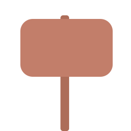

# Block Types in ReForm

ReForm uses a variety of block types to create levels. Each block type has different properties and behaviors. This guide provides an overview of the block types available in ReForm.

## Basic Blocks

- Block (B_BLOCK)

The basic block type. Blocks are solid and can be used to create platforms and walls.

- BlockHollow (B_BLOCKHOLLOW)

A hollow block type. Blocks are solid but have a hole in the middle. Technically aren't any different from the basic block, but they can be used to create interesting shapes and patterns.

- BrickCommon (B_BRICKNORMAL)

A common brick block type. Bricks are solid and can be used to create platforms and walls.

- BrickStone (B_BRICKSTONE)

A stone brick block type. Stone bricks are solid and can be used to create platforms and walls.

- Ground (B_GROUNDMID)

The ground block type. Ground blocks are solid and can be used to create the ground in levels. Different ground block types can be used to create different ground patterns.

- GroundTop (B_GROUNDTOPGRASS)

The top ground block type. Ground top blocks are solid and can be used to create the top part of the ground in levels. Looks best when used with ground blocks.

- GroundTopSand (B_GROUNDTOPSAND)

The top sand ground block type. Ground top sand blocks are solid and can be used to create the top part of the ground in levels. Looks best when used with ground blocks.

- GroundTopSnow (B_GROUNDTOPSNOW)

The top snow ground block type. Ground top snow blocks are solid and can be used to create the top part of the ground in levels. Looks best when used with ground blocks.

- HalfGround (B_GROUNDHALFGRASS)

The half ground block type. Half ground blocks are sliced in half and can are solid. Can be used to create interesting ground patterns.

- LavaMid (B_LAVAMID)

Enables the player to swim in lava. Lava blocks deal significant damage to the player if they touch them.

- LavaTop (B_LAVATOP)

The top lava block type. Lava top blocks deal significant damage to the player if they touch them. Looks best when used with lava blocks.

- RockMid (B_ROCKMID)

The rock block type. Rock blocks are solid and can be used to create platforms and walls.

- RockTop (B_ROCKTOPGRASS)

The top rock block type. Rock top blocks are solid and can be used to create the top part of the rock in levels. Looks best when used with rock blocks.

- RockTopSnow (B_ROCKTOPSNOW)

The top snow rock block type. Rock top snow blocks are solid and can be used to create the top part of the rock in levels. Looks best when used with rock blocks.

- RockTopSand (B_ROCKTOPSAND)

The top sand rock block type. Rock top sand blocks are solid and can be used to create the top part of the rock in levels. Looks best when used with rock blocks.

- WaterMid (B_WATERMID)

Enables the player to swim in water. Water blocks do not deal damage to the player.

- WaterTop (B_WATERTOP)

The top water block type. Water top blocks do not deal damage to the player. Looks best when used with water blocks. Lets the player swim in water.

## Interactive Blocks

- DraggableBlockMetal (I_DRAGGABLESTEEL)

A draggable metal block type. Draggable metal blocks can be pushed by the player and can be used to create moving platforms.

- DraggableBlockWood (I_DRAGGABLEWOOD)

A draggable wood block type. Draggable wood blocks can be pushed by the player and can be used to create moving platforms.

- Elevator (I_ELEVATOR)

An elevator block type. Elevator blocks move up and down or left and right. The player does not move with horizontal elevators. Configurable in the level editor.

- ElevatorRed (I_ELEVATORRED)

A red elevator block type. Red elevator blocks move up and down or left and right. The player does not move with horizontal elevators. Configurable in the level editor.

- ElevatorYellow (I_ELEVATORGOLD)

A yellow elevator block type. Yellow elevator blocks move up and down or left and right. The player does not move with horizontal elevators. Configurable in the level editor.

- ElevatorGreen (I_ELEVATORGREEN)

A green elevator block type. Green elevator blocks move up and down or left and right. The player does not move with horizontal elevators. Configurable in the level editor.

- InfoBoard (I_INFOBOARD)

An info board block type. Info board blocks display a message when the player touches them. Configurable in the level editor.

## Gameplay Blocks

- Portal (G_BLUEPORTAL) (G_REDPORTAL) (G_GREENPORTAL) (G_YELLOWPORTAL)

A portal block type. Portal blocks teleport the player to another portal of the same color. Can't be used to teleport to a portal of a different color, requires a matching pair. Results in an error if there is no matching pair (e.g., a blue portal without a blue portal to teleport to).

- Checkpoint (G_MOVEFLAG)

A checkpoint block type. Checkpoint blocks save the player's progress in the level. If the player dies, they respawn at the last checkpoint they touched.

- FinishFlag (G_FINISH)

A finish flag block type. Finish flag blocks mark the end of the level. The player wins the level when they touch the finish flag.

- FragileBoard (G_FRAGILEBOARD)

A fragile board block type. Fragile board blocks break when the player touches them. Can be used to create breakable platforms.

- KillZone (G_KILLZONE)

A kill zone block type. Kill zone blocks instantly kill the player when they touch them. Invisible to the player in play mode.

- Ladder (G_LADDER)

A ladder block type. Ladder blocks allow the player to climb up and down. Configurable in the level editor.

- LadderTop (G_LADDERTOP)

A ladder top block type. Ladder top blocks allow the player to climb up and down, or jump off the ladder. Configurable in the level editor.

- Spike (G_SPIKE)

A spike block type. Spike blocks deal 20% damage to the player when they touch them. Visible to the player in play mode.

- Trampoline (G_TRAMPOLINEGREEN)

A trampoline block type. Trampoline blocks bounce the player when they touch them.

- VisibleKillZone (G_VISIBLEKILLZONE)

A visible kill zone block type. Visible kill zone blocks instantly kill the player when they touch them. Visible to the player in play mode.

- Sawblade (G_WHEEL)

A sawblade block type. Sawblade blocks deal 25% damage to the player when they touch them, and throw the player in the opposite direction. Visible to the player in play mode.
