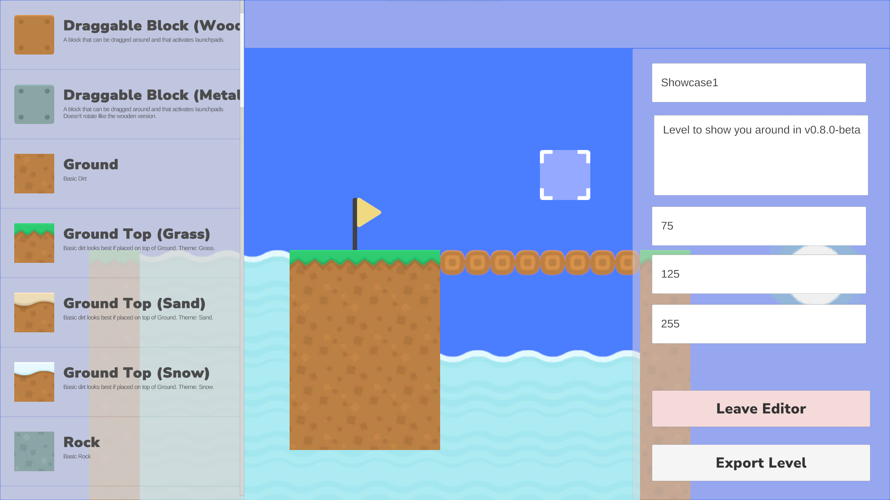

# ReForm Level Editor

The ReForm level editor lets you create custom levels for the game. This guide provides an overview of the level editor and instructions on how to use it.

## Table of Contents

- [Getting Started](#getting-started)
- [Editor Interface](#editor-interface)
- [Controls](#controls)
- [Placing Tiles](#placing-tiles)
- [Configuring Tiles](#configuring-tiles)

## Getting Started

To access the level editor, click on "Create Level" in the main menu of the game. This will open the level editor interface where you can start building your custom level. The level editor provides a grid-based canvas where you can place and configure tiles to create your level.

## Editor Interface

The level editor interface consists of the following components:

On the left side of the screen, you have the tile palette. This palette contains all the available tiles that you can use to build your level. Click on a tile to select it, and then click on the canvas to place the tile.

On the right side of the screen, you have the Level Properties panel. This panel allows you to configure the properties of the level, such as the level name, description, and background color.

In the center of the screen, you have the canvas. This is where you will build your level by placing tiles on a grid. You can move around the canvas by clicking and dragging with the mouse.

At the top, there is the messagebox. This will display messages to the user, such as errors or warnings.

## Controls

The level editor uses the following controls:

- **A** or **Left Arrow**: Move left
- **D** or **Right Arrow**: Move right
- **Space** or **W** or **Up Arrow**: Move up
- **S** or **Down Arrow**: Move down
- **Alt** or **Esc**: Open context menu
- **Shift** or **Right Shift**: Move faster
- **M**: Enable mouse mode
- **Space** or **Left Click**: Place tile
- **V**: Enter tile removal mode
- **Left Click** or **Space** on existing tile: Replace tile

## Placing Tiles

To place a tile on the canvas, select a tile from the tile palette on the left side of the screen. Click on the tile to select it, and then click on the canvas to place the tile. You can place multiple tiles on the canvas to create platforms, walls, and other structures for your level.

## Configuring Tiles

Some tiles like Elevators and InfoBoards have additional properties that you can configure. To configure a tile, simply place it. A configuration panel will appear in the middle of the screen where you can set the properties of the tile. Once you have configured the tile, click on "Spawn" to place the tile with the specified properties.

That's it! You now have the basic knowledge to start creating custom levels in ReForm using the level editor. Experiment with different tiles and configurations to create unique and challenging levels for the game. If you have any questions or need help with the level editor, feel free to reach out to Lyubomir in Discord.